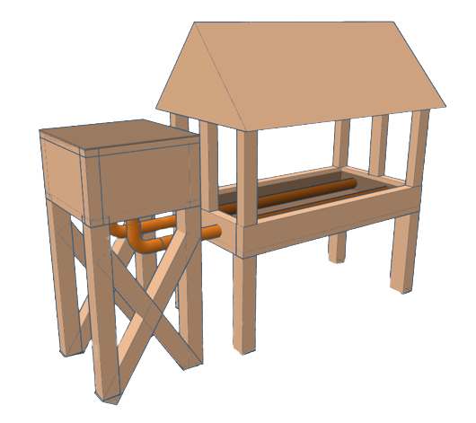

<div id="top"></div>
<!--
*** Thanks for checking out the Best-README-Template. If you have a suggestion
*** that would make this better, please fork the repo and create a pull request
*** or simply open an issue with the tag "enhancement".
*** Don't forget to give the project a star!
*** Thanks again! Now go create something AMAZING! :D
-->

<!-- PROJECT SHIELDS -->
<!--
*** I'm using markdown "reference style" links for readability.
*** Reference links are enclosed in brackets [ ] instead of parentheses ( ).
*** See the bottom of this document for the declaration of the reference variables
*** for contributors-url, forks-url, etc. This is an optional, concise syntax you may use.
*** https://www.markdownguide.org/basic-syntax/#reference-style-links
-->

<!-- PROJECT LOGO -->
<br />

<div align="center">
  <a href="https://github.com/JoaoCardoso00/AutoDrops">
    
  </a>

  <p align="center">
    Sistema de irrigação automático para hortas hortas suspensas
    <br />
    <br />
    <a href="https://github.com/JoaoCardoso00/AutoDrops"><strong>Explore the docs »</strong></a>
    <br />
    <br />
    <a href="https://github.com/JoaoCardoso00/AutoDrops">View Demo</a>
    ·
    <a href="https://github.com/JoaoCardoso00/AutoDrops">Report Bug</a>
    ·
    <a href="https://github.com/JoaoCardoso00/AutoDrops">Request Feature</a>
  </p>

</div>

<!-- TABLE OF CONTENTS -->

<details>
  <summary>Tabela de conteúdos</summary>
  <ol>
    <li>
      <a href="#sobre-o-projeto">Sobre o projeto</a>
      <ul>
        <li><a href="#tecnologias-utilizadas">Tecnologias utilizadas</a></li>
      </ul>
    </li>
    <li>
      <a href="#abrir-e-rodar-o-projeto">Abrir e rodar o projeto</a>
    </li>
    <li><a href="#usos">Usos</a></li>
    <li><a href="#roadmap">Roadmap</a></li>
    <li><a href="#contribuir-para-o-projeto">Contribuir para o projeto</a></li>
    <li><a href="#license">License</a></li>
    <li><a href="#Contato">Contato</a></li>
    <li><a href="#Referências">Referências</a></li>
  </ol>
</details>

<!-- ABOUT THE PROJECT -->

## Sobre o projeto

### O AutoDrops é um kit de sistema de irrigação que foi desenvolvido para solucionar o problema de irrigação nas hortas suspensas na Ilha das Onças.

<div align="center">
  <a href="https://github.com/JoaoCardoso00/AutoDrops">
    
  </a>
</div>

Os habitantes da Ilha das Onças não possuem vasto conhecimento para poder utilizar as hortas em seu maior potencial, assim diminuindo a produção e aumentando os gastos de água, energia e tempo. Enquanto esses gastos podiam ser realocados para outras atividades como: Plantação, colheita e venda do açai, estudos e uso pessoal. Assim a nossa equipe, através de uma pesquisa feita com os habitantes, desenvolvemos o nosso sistema, que usa a técnica de gotejamento para irrigar a horta, e possui um mecanismo automático para regular a taxa de gotejamento e o fluxo de água.

No que o projeto vai ajudar:

- Qualidade da irrigação das hortas
- Tempo para irrigar as hortas
- Monitoramento da qualidade das hortaliças

Assim, como dito acima, procuramos ajudar os habitantes da Ilha das onças **( ou qualquer um que possua uma grande quantidade de hortas e não tem tempo, ou conhecimento, para cuidar)** de tal forma que aumente a sua produtividade e qualidade das hortaliças.

<p align="right"><a href="#top">voltar para o início</a></p>

### Tecnologias utilizadas

Lista de tecnologias utilizadas na construção do projeto.

- [Arduino UNO](https://www.arduino.cc/) (Controle do Fluxo da água)
- [Motor Servo](https://docs.arduino.cc/learn/electronics/servo-motors) (Controle do Fluxo da água)
- [Sensor DHT11](https://www.filipeflop.com/blog/monitorando-temperatura-e-umidade-com-o-sensor-dht11/) (Monitoramento de Temperatura e humidade da horta)

<p align="right"><a href="#top">voltar para o início</a></p>

<!-- GETTING STARTED -->

## Abrir e rodar o projeto

------

### Pré-requisitos

- Arduino IDE:

  ​ [Windows Download Docs](https://docs.arduino.cc/software/ide-v1/tutorials/Windows)

  ​ [macOS Download Docs](https://www.arduino.cc/en/Guide/macOS)

  ​ [Linux Download Docs](https://docs.arduino.cc/software/ide-v1/tutorials/Linux)

### Instalação

1. Clone o repositório

   ```sh
   git clone https://github.com/JoaoCardoso00/AutoDrops.git
   ```

2. Abra o arquivo do script dentro da IDE do arduino

3. Após montar o circuito, dê upload no codigo para dentro do arduino.

<p align="right"><a href="#top">voltar para o início</a></p>

<!-- USAGE EXAMPLES -->

## Usos

O projeto foi criado para a irrigação de hortas suspensas por meio da técnica de gotejamento.

### Funcionalidades

- Sistema de gotejamento para irrigação da horta
- Sistema de sensores para monitoriamento da qualidade da horta
- Sistema de armazenamento de água
- Sistema de controle de fluxo da água

<p align="right"><a href="#top">voltar para o início</a></p>

<!-- ROADMAP -->

## Roadmap

- [ ] Montagem do primeiro protótipo

  - [x] Código inicial do protótipo
  - [x] integração com o motor servo para controle de passagem de água
  - [ ] Integração com sensores para monitorar a qualidade da horta
    - [ ] Teste com os sensores
    - [ ] Validação dos sensores

- [ ] Validação do projeto
- [ ] implementação do projeto na ilha das onças

Veja [open issues](https://github.com/JoaoCardoso00/AutoDrops/issues) para uma lista de funcionalidades recomendadas (e problemas conhecidos).

<p align="right"><a href="#top">voltar para o início</a></p>

<!-- CONTRIBUTING -->

## Contribuir para o projeto

Se você tem alguma sugestão para deixar o projeto melhor, por favor dê um fork neste repostiório e abra um pull request. Você pode tambem abrir um issue com a tag "enhancement".
Não esqueça de dar uma estrela ao projeto!

1. Dê um fork no projeto
2. Crie uma branch para sua funcionalidade (`git checkout -b feature/AmazingFeature`)
3. Dê commit nas suas mudanças (`git commit -m 'Add some AmazingFeature'`)
4. Dê push na sua branch (`git push origin feature/AmazingFeature`)
5. Abra o pull request

<p align="right"><a href="#top">voltar para o início</a></p>

<!-- LICENSE -->

## License

Distributed under the MIT License. See `LICENSE.txt` for more information.

<p align="right"><a href="#top">voltar para o início</a></p>

<!-- CONTACT -->

## Contato

João Cardoso - [in/joão-vcardoso](https://www.linkedin.com/in/jo%C3%A3o-vcardoso/) - jvcq13@gmail.com

Fabio Neves - [in/fabio-neves-55b2831b5](https://www.linkedin.com/in/fabio-neves-55b2831b5/) - fabinhoneves09@gmail.com

Marco Aurélio - [in/marco-aurélio-629008210](https://www.linkedin.com/in/marco-aur%C3%A9lio-629008210/) - jvcq13@gmail.com

Newton Miranda - [in/nykontx](https://www.linkedin.com/in/nykontx/) - jvcq13@gmail.com

João Cardoso - [@daarkeae](https://twitter.com/daarkeae) - jvcq13@gmail.com

Link do projeto: [https://github.com/JoaoCardoso00/AutoDrops](https://github.com/JoaoCardoso00/AutoDrops)

<p align="right"><a href="#top">voltar para o início</a></p>

<!-- ACKNOWLEDGMENTS -->

## Referências

Use this space to list resources you find helpful and would like to give credit to. I've included a few of my favorites to kick things off!

- [Arduino](https://www.arduino.cc/)

- [Arduino IDE](https://www.arduino.cc/en/software)

- [Motor Servo](https://docs.arduino.cc/learn/electronics/servo-motors)

- [Sensor DHT11](https://www.filipeflop.com/blog/monitorando-temperatura-e-umidade-com-o-sensor-dht11/)

- [Sistema de irrigação por gotejamento](https://pt.wikipedia.org/wiki/Sistema_de_irriga%C3%A7%C3%A3o_por_gotejamento)

<p align="right"><a href="#top">voltar para o início</a></p>

<!-- MARKDOWN LINKS & IMAGES -->
<!-- https://www.markdownguide.org/basic-syntax/#reference-style-links -->

[contributors-shield]: https://img.shields.io/github/contributors/othneildrew/Best-README-Template.svg?style=for-the-badge
[contributors-url]: https://github.com/othneildrew/Best-README-Template/graphs/contributors
[forks-shield]: https://img.shields.io/github/forks/othneildrew/Best-README-Template.svg?style=for-the-badge
[forks-url]: https://github.com/othneildrew/Best-README-Template/network/members
[stars-shield]: https://img.shields.io/github/stars/othneildrew/Best-README-Template.svg?style=for-the-badge
[stars-url]: https://github.com/othneildrew/Best-README-Template/stargazers
[issues-shield]: https://img.shields.io/github/issues/othneildrew/Best-README-Template.svg?style=for-the-badge
[issues-url]: https://github.com/othneildrew/Best-README-Template/issues
[license-shield]: https://img.shields.io/github/license/othneildrew/Best-README-Template.svg?style=for-the-badge
[license-url]: https://github.com/othneildrew/Best-README-Template/blob/master/LICENSE.txt
[linkedin-shield]: https://img.shields.io/badge/-LinkedIn-black.svg?style=for-the-badge&logo=linkedin&colorB=555
[linkedin-url]: https://linkedin.com/in/othneildrew
[product-screenshot]: images/screenshot.png
